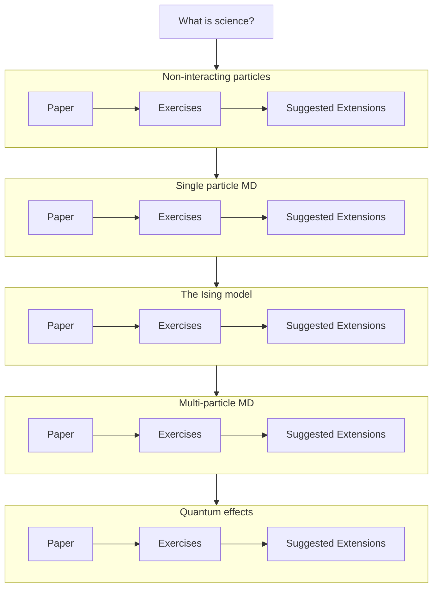

# MTH4332: Resources for statistical mechanics course in Queen's University Belfast

## Aims 

For students who are not studying at Queen's University Belfast, I have put these resources on basic statistical mechanics 
in the hope that you find within them a useful introduction to the topic of statistical mechanics.

For students who are studying at Queen's University Belfast, I have put these resources here in the hope that this basic course
is a start point for a deeper exploration into the topic of statistical mechanics. In other words, I want you not just to explore the 
resources in this tutorial.  If you feel able, __I want you to explore other tutorials on the PLUMED tutorials site and in so doing 
learn about cutting edge research in this field.__  The portfolio assignment for the MTH4332 have been deliberately designed in a way that allows you
to submit work that you have done by following the exercises in this tutorial or in any of the other tutorials on this site.

## What is covered

There are five exercises for you to work through here that cover:

1. Evaluating average energies for systems of non-interacting particles numerically and analytically.
2. Running molecular dynamics to evaluate the heat capacity for a single particle on an energy landscape.
3. Simulating the 2D Ising model to introduce theories of phase transitions.
4. Running molecular dynamics on systems of interacting Lennard Jones particles and applying what you have learned about phase transitions.
5. Understanding harmonic quantum effects.

I have written a short paper on each of these topics that describes how I used simulation to explore the theoretical ideas.  You can find these 
papers by clicking on the links in the graph that follows.  The graph also contains links to a self-marking notebook resource that contains 
exercises that should help you to reproduce the simulations that I ran when I wrote the papers.  For each paper, you will also find a link to a
page that provides suggestions on things you can do to extend the work that I presented in my papers.  Please use these suggestions when you are 
using these resources to prepare your portfolio report.

By presenting the material this way I hope you will see how we do new research in statistical mechanics.  This topic provides a set of [technical objects](research.md) that allow
us to use what we know about the microscopic behaviours of atoms and molecules to understand the behaviour of large ensembles of of these particles. My 
contention is that research in statistical mecahnics is often about finding the minimal description of the microscopic behaviour of atoms and molecules that
reproduces the known macroscopic behaviours.  Some questions we might ask when doing research in this field include:

1. Do we need to have an explict description of the electronic degrees of freedom?
2. Do we need to describe the interactions between particles or can we treat them as non-interacting?
3. Do we need to understand the internal degrees of freedom of molecules or can we average these out?
4. Can we treat nuclei as if they are classical particles? In other words, are nuclear quantum effects important?   

For the majority of physical systems that are under active study these are still active questions. The material presented in this course should not be seen not as a static 
body of theory that must be learned. Instead, these ideas are the tools that you can use for answering these questions for physical systems that interest you.

